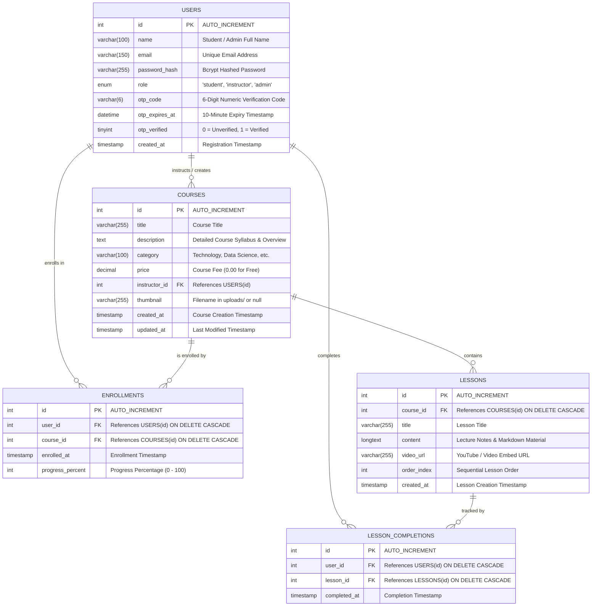

# Entity Relationship Diagram (ERD) & Data Model Specification
## Capstone Project: E-Learning Portal
**Database Engine:** MySQL 8.0+ / MariaDB 10.4+ (InnoDB Engine)  
**Database Name:** `elearning_db`  
**Character Set:** `utf8mb4` | **Collation:** `utf8mb4_unicode_ci`  

---

## 1. Visual Entity Relationship Diagram (Mermaid)

---

## 2. Table Specifications & Data Dictionary

### 2.1 `users`
Stores user credentials, role-based privileges, and email OTP verification tokens.

| Column | Type | Nullable | Default | Description & Constraints |
| :--- | :--- | :--- | :--- | :--- |
| `id` | `INT` | NO | `AUTO_INCREMENT` | Primary Key |
| `name` | `VARCHAR(100)` | NO | None | Full legal or display name |
| `email` | `VARCHAR(150)` | NO | None | Unique login email (`UNIQUE KEY`) |
| `password_hash`| `VARCHAR(255)` | NO | None | Bcrypt algorithm hash |
| `role` | `ENUM('student','instructor','admin')` | NO | `'student'` | Access privilege level |
| `otp_code` | `VARCHAR(6)` | YES | `NULL` | Cryptographic 6-digit OTP |
| `otp_expires_at`| `DATETIME` | YES | `NULL` | Timestamp for 10-minute expiry |
| `otp_verified` | `TINYINT(1)` | NO | `0` | Account verification flag |
| `created_at` | `TIMESTAMP` | NO | `CURRENT_TIMESTAMP` | Account creation date |

### 2.2 `courses`
Contains instructional courses cataloged by category and taught by instructors.

| Column | Type | Nullable | Default | Description & Constraints |
| :--- | :--- | :--- | :--- | :--- |
| `id` | `INT` | NO | `AUTO_INCREMENT` | Primary Key |
| `title` | `VARCHAR(255)` | NO | None | Course headline / title |
| `description` | `TEXT` | NO | None | Comprehensive course outline |
| `category` | `VARCHAR(100)` | NO | None | Category filter indexed (`INDEX`) |
| `price` | `DECIMAL(10,2)`| NO | `0.00` | Course tuition fee |
| `instructor_id`| `INT` | NO | None | Foreign Key referencing `users(id)` |
| `thumbnail` | `VARCHAR(255)` | YES | `NULL` | Image path in `uploads/` |
| `created_at` | `TIMESTAMP` | NO | `CURRENT_TIMESTAMP` | Record creation date |
| `updated_at` | `TIMESTAMP` | NO | `CURRENT_TIMESTAMP` | Auto-updating modification timestamp |

### 2.3 `lessons`
Individual syllabus lessons belonging to a parent course, ordered sequentially.

| Column | Type | Nullable | Default | Description & Constraints |
| :--- | :--- | :--- | :--- | :--- |
| `id` | `INT` | NO | `AUTO_INCREMENT` | Primary Key |
| `course_id` | `INT` | NO | None | Foreign Key referencing `courses(id)` |
| `title` | `VARCHAR(255)` | NO | None | Lesson topic title |
| `content` | `LONGTEXT` | YES | `NULL` | Detailed lecture text & notes |
| `video_url` | `VARCHAR(255)` | YES | `NULL` | Embeddable video URL (YouTube, Vimeo) |
| `order_index` | `INT` | NO | `1` | Sequential curriculum ordering index |
| `created_at` | `TIMESTAMP` | NO | `CURRENT_TIMESTAMP` | Timestamp |

### 2.4 `enrollments`
Tracks active course enrollments and aggregate student completion percentages.

| Column | Type | Nullable | Default | Description & Constraints |
| :--- | :--- | :--- | :--- | :--- |
| `id` | `INT` | NO | `AUTO_INCREMENT` | Primary Key |
| `user_id` | `INT` | NO | None | Foreign Key referencing `users(id)` |
| `course_id` | `INT` | NO | None | Foreign Key referencing `courses(id)` |
| `enrolled_at` | `TIMESTAMP` | NO | `CURRENT_TIMESTAMP` | Enrollment timestamp |
| `progress_percent`| `INT` | NO | `0` | Computed completion percentage (0–100%) |

**Constraints:**
- Composite Unique Index: `UNIQUE KEY uq_user_course (user_id, course_id)` prevents redundant enrollments.

### 2.5 `lesson_completions`
Provides granular tracking of which individual lessons each student has completed.

| Column | Type | Nullable | Default | Description & Constraints |
| :--- | :--- | :--- | :--- | :--- |
| `id` | `INT` | NO | `AUTO_INCREMENT` | Primary Key |
| `user_id` | `INT` | NO | None | Foreign Key referencing `users(id)` |
| `lesson_id` | `INT` | NO | None | Foreign Key referencing `lessons(id)` |
| `completed_at` | `TIMESTAMP` | NO | `CURRENT_TIMESTAMP` | Timestamp when marked complete |

**Constraints:**
- Composite Unique Index: `UNIQUE KEY uq_user_lesson (user_id, lesson_id)` guarantees idempotent completion tracking.

---

## 3. Relational Integrity & Cascading Actions
1. **`courses.instructor_id -> users.id`**: `ON DELETE CASCADE` ensures data consistency if an instructor profile is removed.
2. **`lessons.course_id -> courses.id`**: `ON DELETE CASCADE` automatically cleans up associated lessons when a course is deleted.
3. **`enrollments.user_id -> users.id` & `enrollments.course_id -> courses.id`**: `ON DELETE CASCADE` prevents orphaned enrollment records.
4. **`lesson_completions.lesson_id -> lessons.id`**: `ON DELETE CASCADE` maintains synchronized completion logs when lessons are pruned.
